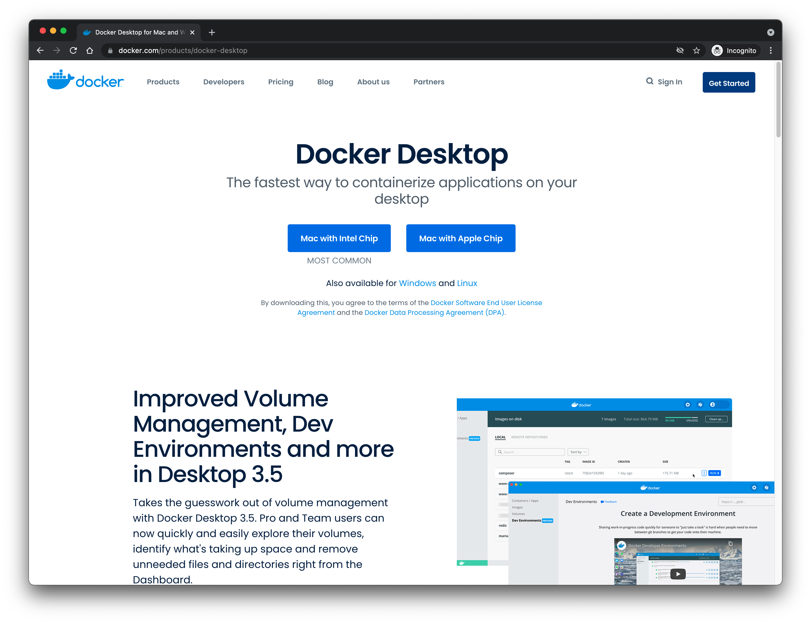
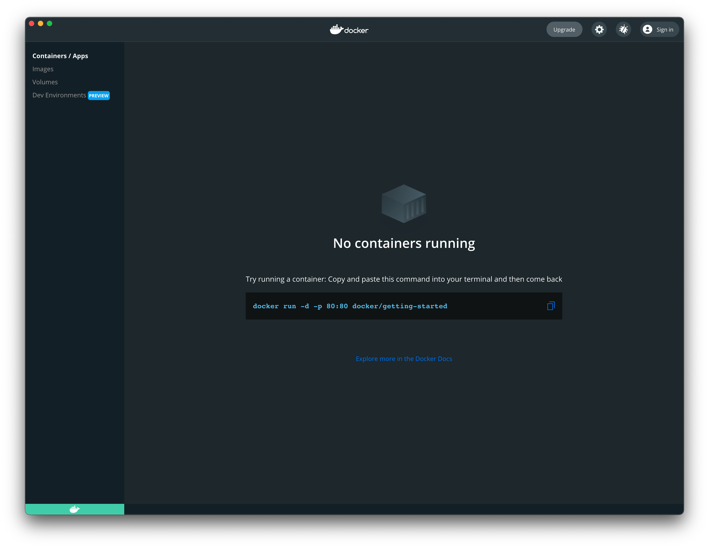



Setting up a bioinformatics workstation can be a tedious and frustrating process. Sometimes, it might require a system administrator, especially when it comes to the not-uncommon endless loop of dependencies between the tools and libraries. So, an out-of-the-box preinstalled workstation will save you a lot of time and hassle and allow you to focus on the research questions you are addressing. This applies to a BLAST search or genome mapping running on your personal laptop on your desk or a high-performance computing server in the data center at your institution.

This short tutorial shows how to build a bioinformatics workstation on any computing device and operating system that supports [Docker](https://www.docker.com/), including laptops, servers, and workstations running Windows, Mac OS, or Linux. After completing these steps, you will have a working system for bioinformatics analyses.

Docker is a [virtualization](https://en.wikipedia.org/wiki/Virtualization) solution that separates the virtual machine (the container) from the actual operating system. This separation includes all installations, configurations, and computes that happen within the container. So in a way, what happens in the Docker stays in the Docker.

The beauty of virtualization is [**portability**](https://en.wikipedia.org/wiki/Porting) (run it anywhere) and [**reproducibility**](https://en.wikipedia.org/wiki/Reproducibility) (same infrastructure shared and available for anyone to rerun exact analyses and reproduce exact results). First, create a container with a specific set of tools and settings. Then, you can share and distribute this exact image privately or publicly so others can use it as is without having to reinvent the wheel. There are other virtualization tools besides Docker, for example, Oracle’s VirtualBox.

I created a Docker image, [`bioinformatics-toolbox`](https://ahmedmoustafa.github.io/bioinformatics-toolbox/), with the standard and essential bioinformatics packages and languages, including NCBI BLAST and HMMER. For the complete list of tools, see here. The following is a walkthrough of the steps to get your bioinformatics workstations up and running. However, to speed up the download, we will use a smaller version of the toolbox, called bioinformatics-toolbox-light, with only a subset of the tools, as a proof-of-concept.

## Step 1. Install Docker
Docker is available for Windows, Mac OS (for Apple and Intel chips), and Linux ([Ubuntu](https://ubuntu.com/), [CentOS](https://www.centos.org/), [Fedora](https://getfedora.org/), and others). Go to [the Docker Desktop product page](https://www.docker.com/products/docker-desktop) to download the correct version for your systems and install it.

Please refer to [the Docker Desktop documentation](https://docs.docker.com/desktop/) for further details on the installation steps [on Mac](https://docs.docker.com/docker-for-mac/install/) or [on Windows](https://docs.docker.com/docker-for-windows/install/). Basically, you want to start with the following screen (download page) to reach the screen after (installed and running Docker Desktop):

**The Docker Desktop Homepage**

**The Docker Desktop Installed (on Mac)**

## Step 2. Install Bioinformatics Toolbox Image
Now go to your Terminal (in Mac or Linux) or Command (in Windows) and run the following command:

`docker run -it --name repo ghcr.io/ahmedmoustafa/bioinformatics-toolbox-light clone the-toolbox-light`

This command will attempt to launch the container, but the image is not locally available yet, so the image will be automatically downloaded for you from the registry. After the download is complete and successful, the container will start with all the already preinstalled tools. Then, if the image in the registry gets updated, the same command will take care of obtaining the updates, usually incremental.
