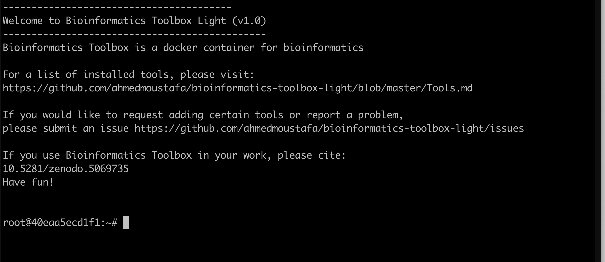




Setting up a bioinformatics workstation can be a tedious and frustrating process. Sometimes, it might require a system administrator, especially when it comes to the not-uncommon endless loop of dependencies between the tools and libraries. So, an out-of-the-box preinstalled workstation can save a lot of time and hassle and allow you to focus on the research questions you are addressing. This applies to a BLAST search or genome mapping running on your personal laptop on your desk or a high-performance computing server in the data center at your institution.

This short tutorial shows how to build a bioinformatics workstation on any computing device and operating system that supports [Docker](https://www.docker.com/), including laptops, servers, and workstations running Windows, Mac OS, or Linux. After completing these steps, you will have a working system for bioinformatics analyses.


Docker is a [virtualization](https://en.wikipedia.org/wiki/Virtualization) solution that separates the virtual machine (the container) from the actual operating system. This separation includes all installations, configurations, and computes that happen within the container. So in a way, what happens in the Docker stays in the Docker.


The beauty of virtualization is [**portability**](https://en.wikipedia.org/wiki/Porting) (run it anywhere) and [**reproducibility**](https://en.wikipedia.org/wiki/Reproducibility) (same infrastructure shared and available for anyone to rerun exact analyses and reproduce exact results). First, create a container with a specific set of tools and settings. Then, you can share and distribute this exact image privately or publicly so others can use it as is without having to reinvent the wheel. There are other virtualization tools besides Docker, for example, Oracle’s VirtualBox.

I created a Docker image, [`bioinformatics-toolbox`](https://ahmedmoustafa.github.io/bioinformatics-toolbox/), with the standard and essential bioinformatics packages and languages, including BLAST, [MAFFT](https://mafft.cbrc.jp/alignment/software/), [Samtools](http://www.htslib.org/), and many other tools. For the complete list of the included tools, see [here](https://ahmedmoustafa.github.io/bioinformatics-toolbox/Tools.html).

The following is a walkthrough of the *two* steps to get your bioinformatics workstation up and running. However, to speed up the download, we will use a smaller version of the toolbox, `bioinformatics-toolbox-light`, with a subset of the tools, as a proof-of-concept.

## Step 1. Install Docker
Docker is available for free for Windows, Mac OS (for Apple and Intel chips), and Linux ([Ubuntu](https://ubuntu.com/), [CentOS](https://www.centos.org/), [Fedora](https://getfedora.org/), and others). First, go to [the Docker Desktop product page](https://www.docker.com/products/docker-desktop) to download the correct version for your systems and install it.

Please refer to [the Docker Desktop documentation](https://docs.docker.com/desktop/) for further details on the installation steps [on Mac](https://docs.docker.com/docker-for-mac/install/) or [on Windows](https://docs.docker.com/docker-for-windows/install/). Basically, you want to start with the following screen (download page) to reach the screen after (installed and running Docker Desktop):


**The Docker Desktop Homepage**


**The Docker Desktop Installed (on Mac)**

## Step 2. Install Bioinformatics Toolbox Image
Now go to your Terminal (on Mac or Linux) or Command (on Windows) and run the following command:

```bash
docker run -it --name the-toolbox-light ghcr.io/ahmedmoustafa/bioinformatics-toolbox-light
```

The above command will attempt to launch the container, but the image is not locally available yet, so the image will be automatically downloaded for you from the Github's Docker registry [ghcr.io](http://ghcr.io).

This step will take time, depending on the speed of your Internet connection. In my case, it took about two hours to download the 20G image (This is the light version. The full version is larger than 40G). So, maybe it is time to go for coffee


After the download is complete and successful, the container will start with all the already preinstalled tools. The `bioinformatics-toolbox-light` container is running now:



## Example - BLAST SARS-CoV-2 Genomes

The next part is a toy example for using the bioinformatics toolbox container, which we have just installed. We will use BLAST to search for a SARS-CoV-2 isolate in a BLAST-formatted database of SARS-CoV-2 genomes ([`coronadb`](https://github.com/ahmedmoustafa/coronadb)). The database contains about 400,000 complete viral genomes obtained from [NCBI](https://www.ncbi.nlm.nih.gov/datasets/coronavirus/genomes/). `coronadb` is already included in the installed image. You can find it under directory `/data/coronadb`.


So let's move to to the `coronadb` directory using the following command:

```bash
cd /data/coronadb
```

The query sequence is the first published SARS-CoV-2 genome from Egypt, which was collected in March 2020, [MW451601](https://www.ncbi.nlm.nih.gov/nuccore/MW451601), and it is stored in [`myquery.fas`](https://github.com/ahmedmoustafa/coronadb/blob/main/myquery.fas) located in the same directory.

Finally, to run the BLAST search, use the following command to search [MW451601](https://www.ncbi.nlm.nih.gov/nuccore/MW451601) against `coronadb` and display the top 10 matches in a tabular format:

```bash
blastn -db coronadb -query myquery.fas -max_target_seqs 10 -outfmt 6
```

After the BLAST search is complete, it will generate the following output:


With that, now you have your bioinformatics workstation 🤗 Happy Bioinformatics! 😉
